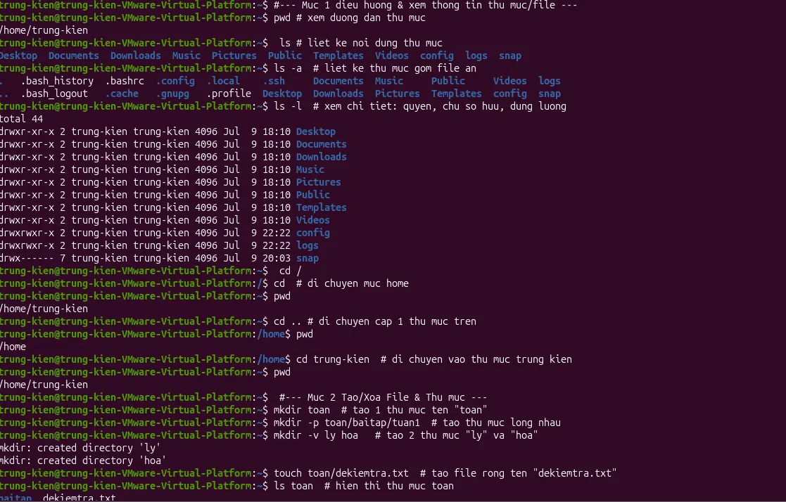
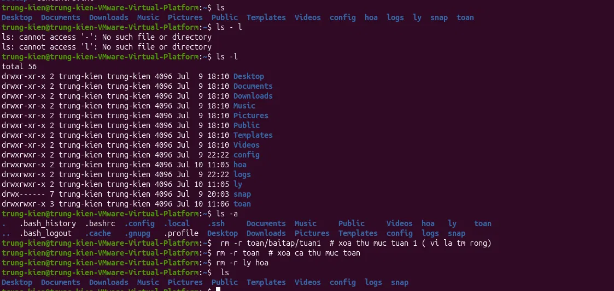
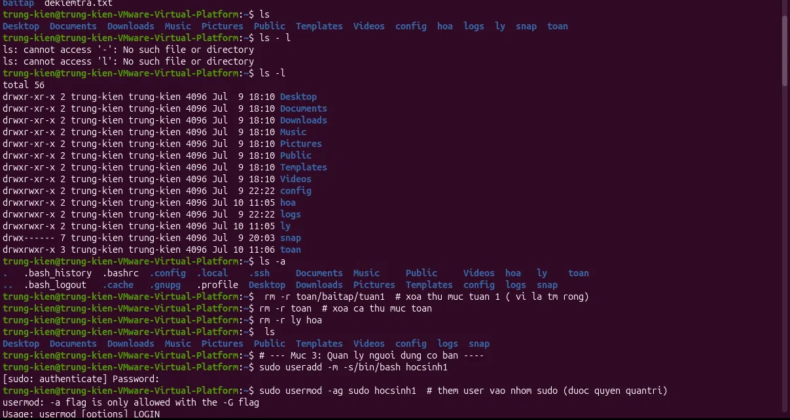
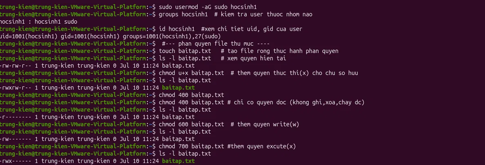
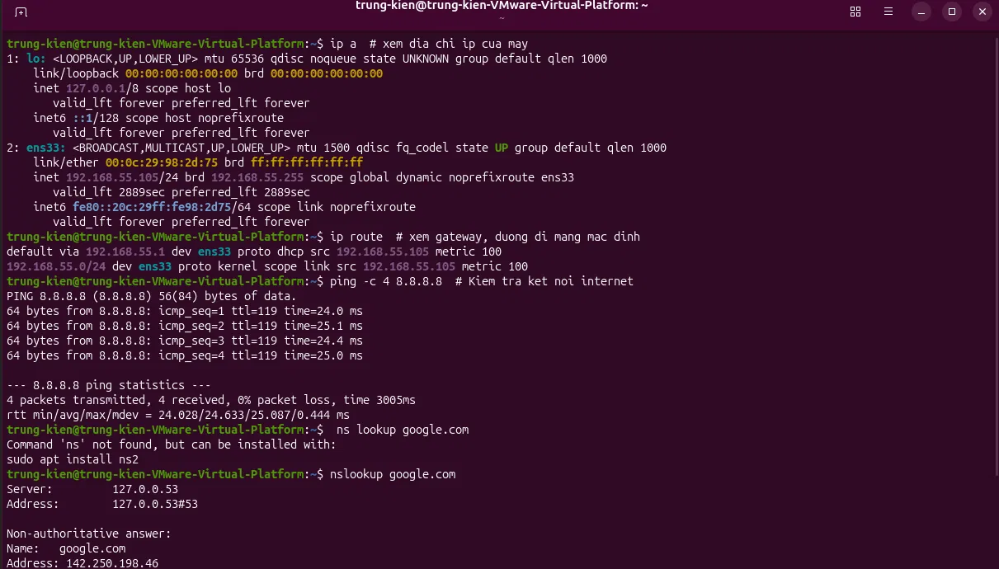
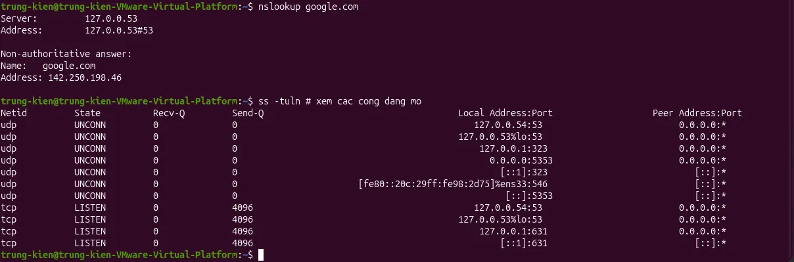

# Linux System Administration — Practice Log

Nhật ký thực hành quản trị hệ thống Linux (Ubuntu) trên môi trường máy ảo VMware, nhằm củng cố kiến thức nền tảng cho vị trí IT Support

## Mục tiêu

Thực hành các thao tác quản trị hệ thống cơ bản mà một IT Support cần nắm vững: quản lý file/thư mục, quản lý người dùng, và phân quyền truy cập trên Linux.

## Nội dung thực hành

### 1. Điều hướng & quản lý thư mục, file
Thực hành các lệnh xem đường dẫn hiện tại, liệt kê nội dung thư mục (bao gồm file ẩn), xem chi tiết quyền/chủ sở hữu, và thao tác tạo file/thư mục cơ bản.

**Lệnh sử dụng:** `pwd`, `ls`, `ls -a`, `ls -l`, `cd`, `mkdir`, `mkdir -p`, `touch`

### 2. Xóa thư mục và file
Thực hành xóa thư mục lồng nhau và kiểm tra lại hệ thống sau khi dọn dẹp.

**Lệnh sử dụng:** `rm -r`, `ls`

### 3. Quản lý người dùng cơ bản
Thực hành tạo tài khoản người dùng mới, cấp quyền quản trị (sudo), và kiểm tra thông tin tài khoản.

**Lệnh sử dụng:** `useradd -m -s /bin/bash`, `usermod -aG sudo`, `groups`, `id`

### 4. Phân quyền file (chmod)
Thực hành các mức phân quyền cơ bản trên file theo chuẩn Linux: chỉ đọc, đọc-ghi, và đầy đủ quyền thực thi.

**Lệnh sử dụng:** `chmod u+x`, `chmod 400`, `chmod 600`, `chmod 700`

### 5. Kiểm tra thông tin mạng
Thực hành kiểm tra kết nối mạng cơ bản trên hệ thống — kỹ năng thiết yếu để chẩn đoán sự cố mạng, một trong những yêu cầu thường gặp nhất của vị trí IT Support.

- Xác minh địa chỉ IP và gateway của máy thông qua giao diện mạng (ens33)
- Kiểm tra kết nối internet bằng lệnh ping, xác nhận tỷ lệ mất gói (packet loss) bằng 0%
- Tra cứu DNS để xác minh khả năng phân giải tên miền
- Kiểm tra danh sách các cổng đang lắng nghe trên hệ thống

**Lệnh sử dụng:** `ip a`, `ip route`, `ping`, `nslookup`, `ss -tuln`

*Xác minh địa chỉ IP, gateway, kiểm tra kết nối internet bằng ping và tra cứu DNS*

*Danh sách các cổng (port) đang lắng nghe trên hệ thống bằng lệnh ss*

## Kỹ năng đã củng cố

- Quản lý file và thư mục trên dòng lệnh Linux
- Tạo và phân quyền tài khoản người dùng (user, sudo group)
- Kiểm soát quyền truy cập file theo mô hình phân quyền Linux (rwx)
- Sử dụng terminal để chẩn đoán và thao tác hệ thống cơ bản
- Kiểm tra và chẩn đoán kết nối mạng cơ bản (IP, gateway, DNS, cổng mạng)
## Môi trường thực hành

Hệ điều hành Ubuntu (Linux) chạy trên nền tảng ảo hóa VMware Workstation, thao tác qua Bash Shell / Terminal.

---
*Repo được xây dựng nhằm phục vụ định hướng phát triển sự nghiệp trong lĩnh vực IT Support.*
